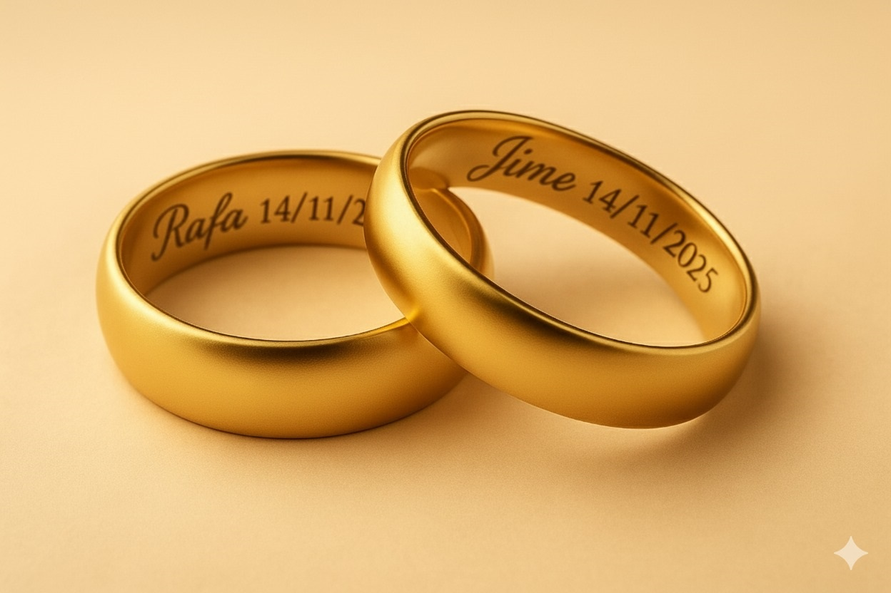
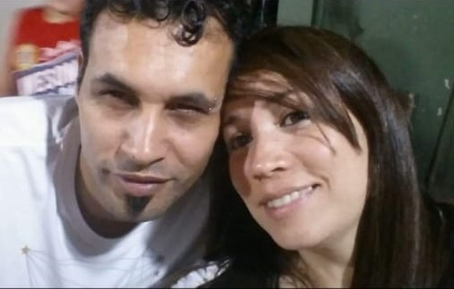
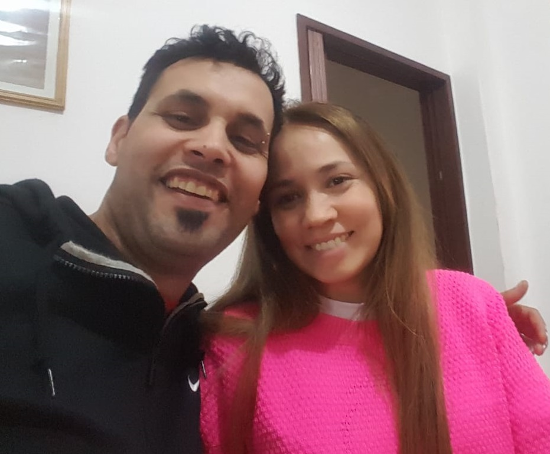
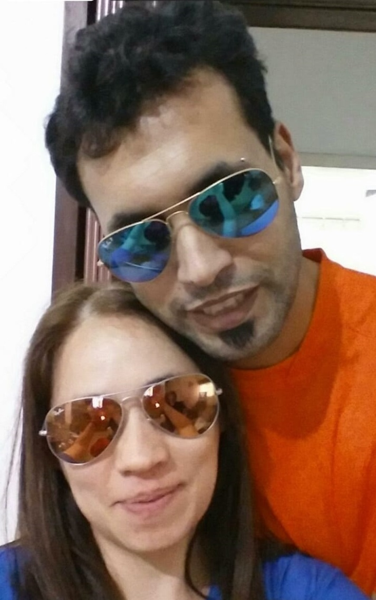
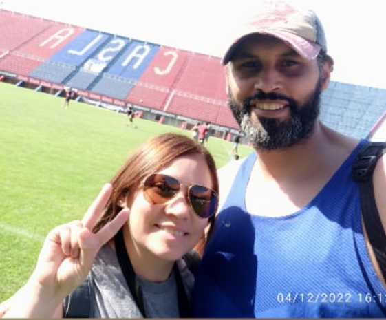
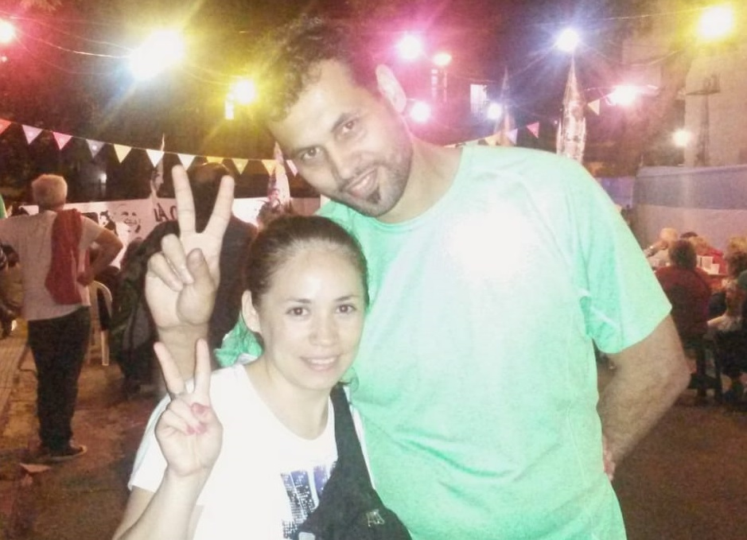
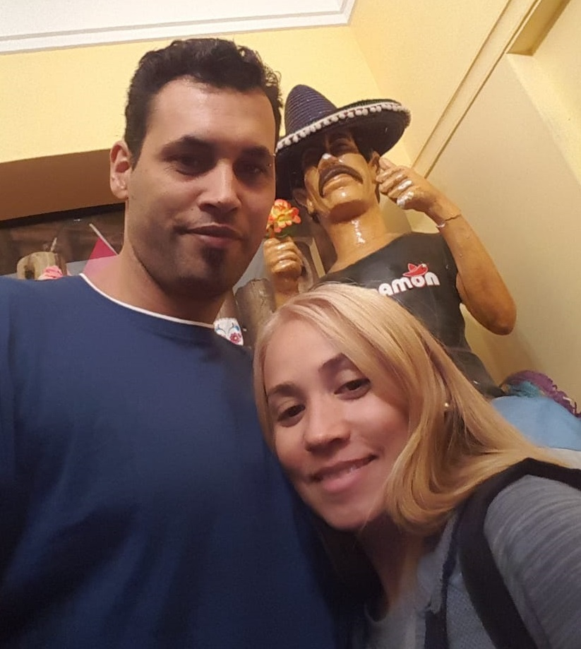
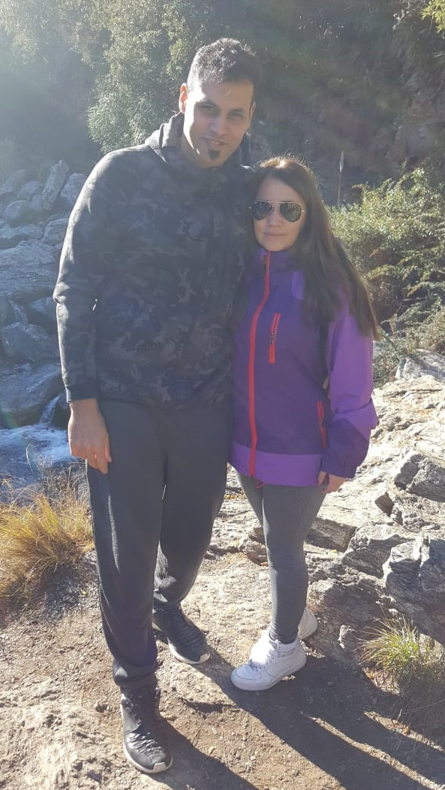
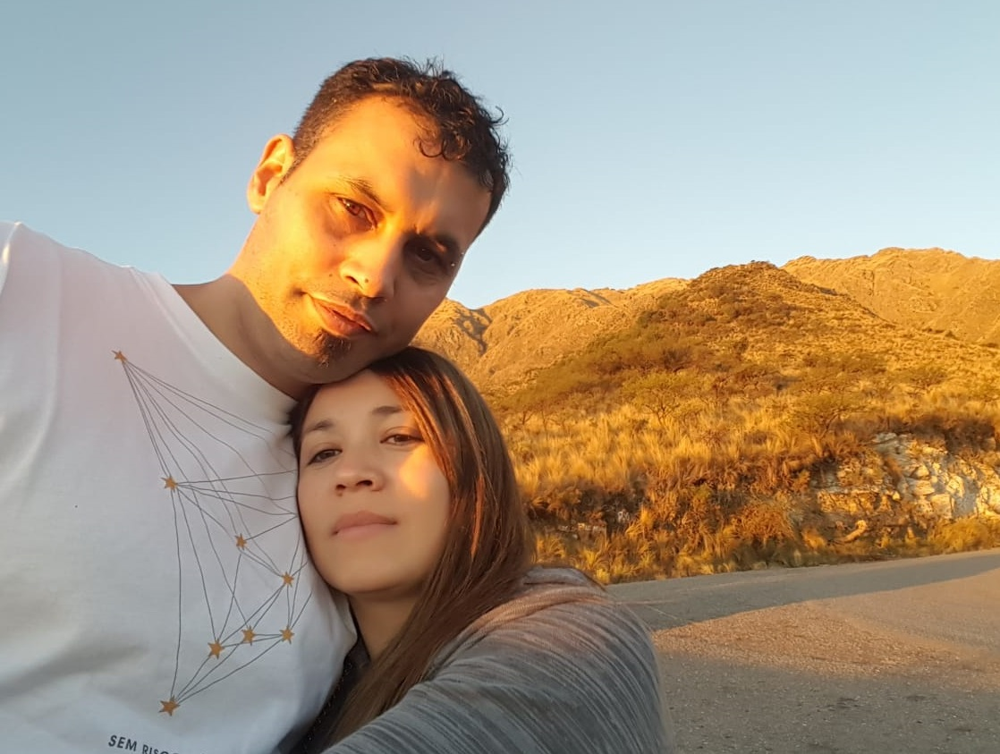
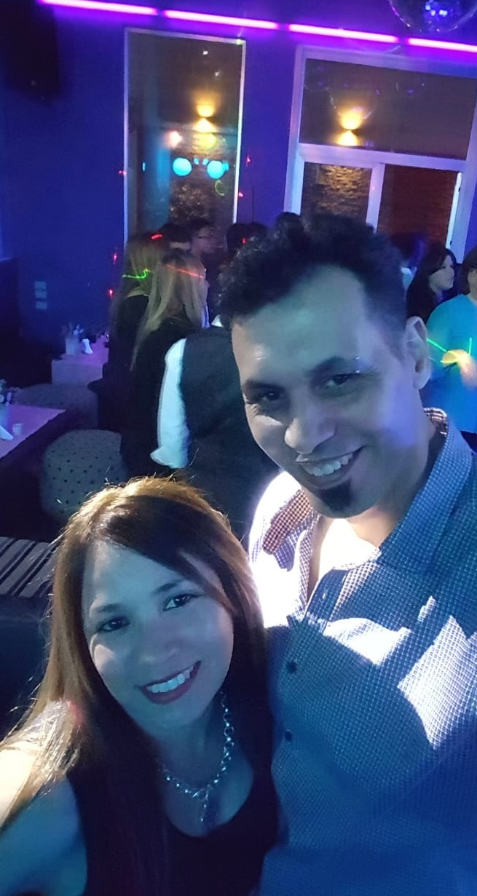

<!DOCTYPE html>
<html lang="es">
<head>
  <meta charset="utf-8" />
  <meta name="viewport" content="width=device-width, initial-scale=1" />
  <title>Jime & Rafa · 14/11/2025</title>
  <meta name="description" content="Invitación de boda de Jime & Rafa" />
  <link rel="preconnect" href="https://fonts.googleapis.com">
  <link rel="preconnect" href="https://fonts.gstatic.com" crossorigin>
  <link href="https://fonts.googleapis.com/css2?family=Great+Vibes&family=Playfair+Display:wght@500;700&family=Montserrat:wght@400;500;700&display=swap" rel="stylesheet">
  
</head>
<body>
  <header class="hero">
    

    

      
      <h1 class="names">Jime & Rafa</h1>
      
14 · 11 · 2025

      
¡Nos casamos!

      <button id="rsvpBtn" class="btn primary">Confirmar asistencia</button>
    

    <!-- Audio -->
    <audio id="bgm" preload="auto" loop playsinline>
      <source src="audio/somos-uno.mp3" type="audio/mpeg">
      Tu navegador no soporta el elemento de audio.
    </audio>

    <!-- Botón musical con icono -->
    <button id="musicToggle" class="music-btn" aria-label="Música">
      <svg viewBox="0 0 24 24" width="22" height="22" aria-hidden="true">
        <path d="M12 3v11.55a3.5 3.5 0 1 1-2-3.15V6.5l9-2V13.3a3.5 3.5 0 1 1-2-3.15V3.5l-5 1V3z" fill="currentColor"/>
      </svg>
    </button>
  </header>

  <main>
    <!-- ⏳ Cuenta regresiva arriba del WhatsApp -->
    

    <section class="card">
      <h2>El Civil</h2>
      
<strong>Te esperamos el día Viernes 14/11, a las 13:30 hs</strong>

      
📍 Nuestra Señora del Buen Viaje 470, Morón

      <a class="btn" target="_blank" rel="noopener" href="https://www.google.com/maps/search/?api=1&query=Nuestra+Se%C3%B1ora+del+Buen+Viaje+470+Mor%C3%B3n">Ver en Maps</a>
    </section>

    <section class="card">
      <h2>La Celebración</h2>
      
<strong>Festejamos juntos el día Sábado 15/11 a las 20:00 hs</strong>

      
📍 Puente Gualeguaychú 1359, General Rodríguez, Provincia de Buenos Aires

      <a class="btn" target="_blank" rel="noopener" href="https://www.google.com/maps/search/?api=1&query=Puente+Gualeguaych%C3%BA+1359+General+Rodr%C3%ADguez+Buenos+Aires">Ver en Maps</a>
    </section>

    <section class="gallery card">
      <h2>Nuestra historia</h2>
      

        
        
        
        
        
        
        
        
        
      

    </section>

    <section class="card rsvp" id="rsvp">
      <h2>Confirmación de asistencia</h2>
      
¡Nos encanta que quieras venir! Completá este formulario y confirmá por WhatsApp 💬

      <form id="rsvpForm">
        

          <label for="nombre">Nombre y Apellido</label>
          <input type="text" id="nombre" name="nombre" placeholder="Tu nombre completo" required>
        

        

          <label for="asistencia">¿Asistís?</label>
          <select id="asistencia" name="asistencia" required>
            <option value="Sí">Sí</option>
            <option value="No">No</option>
          </select>
        

        

          <label for="acompanantes">Acompañantes</label>
          <input type="number" id="acompanantes" name="acompanantes" value="0" min="0" required>
        

        

          <label for="cancion">Recomendá un temazo para el baile 💃🕺</label>
          <input type="text" id="cancion" name="cancion" placeholder="¿Qué querés escuchar?">
        

        <button type="submit" class="btn">Enviar confirmación</button>
      </form>

      
Las confirmaciones se envían por WhatsApp al <strong>+54 9 11 6044-9885</strong>.

    </section>
  </main>

  <footer class="footer">
    
Con amor, Jime & Rafa • 14/11/2025

  </footer>

  
</body>
</html>
